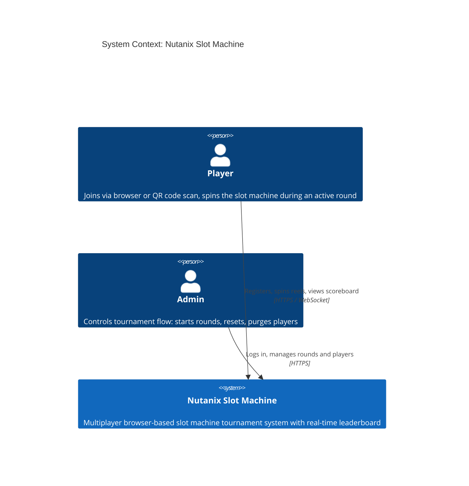
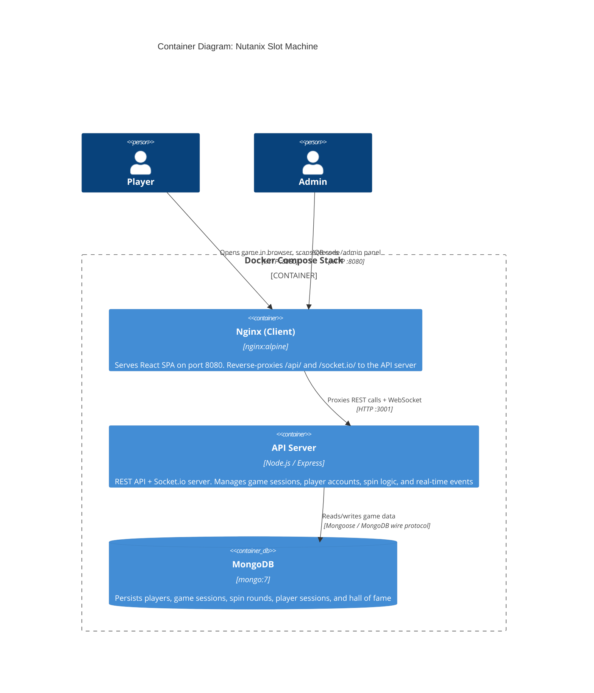
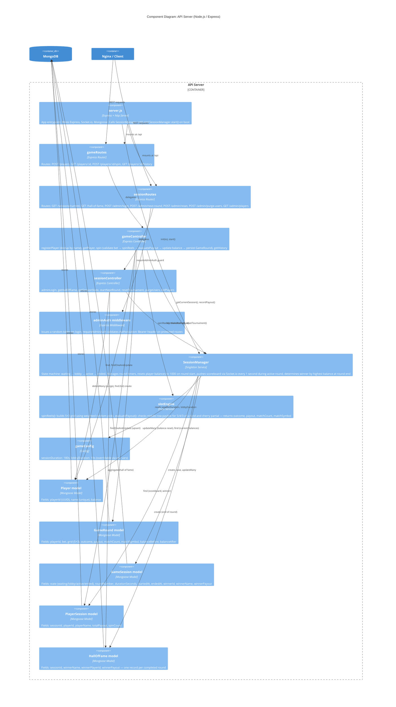
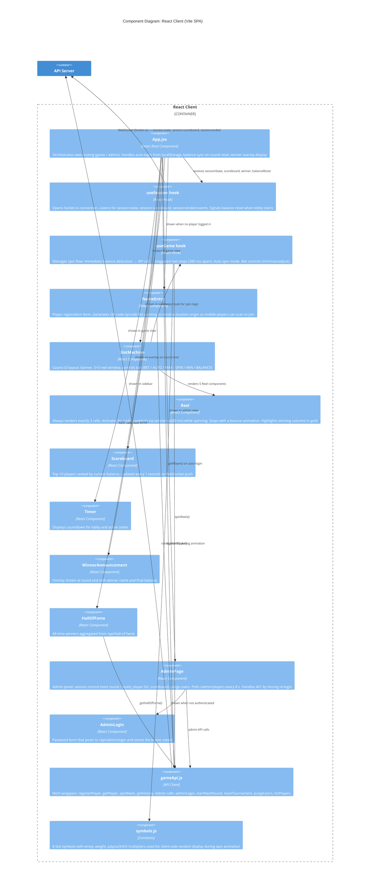
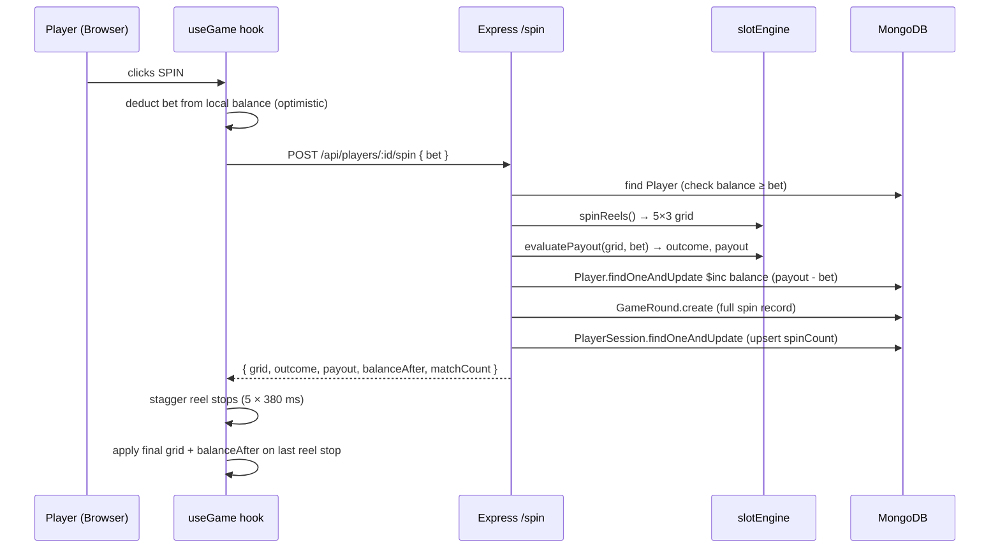
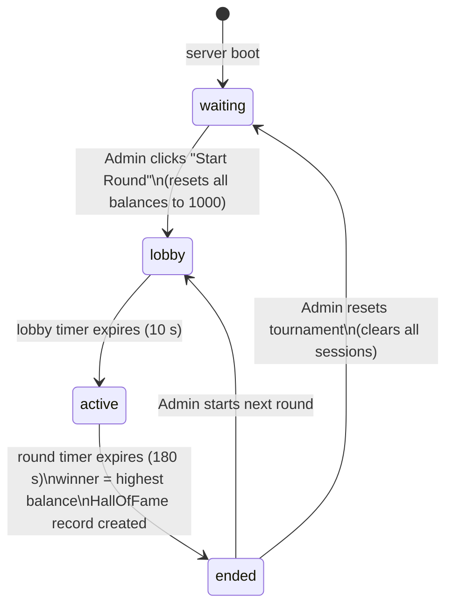
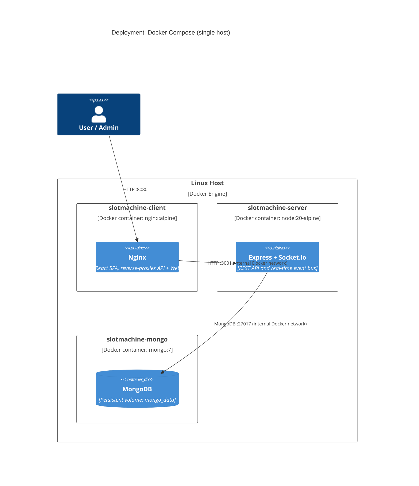

# C4 Architecture Diagram — Nutanix Slot Machine

---

## Level 1 — System Context

---

## Level 2 — Container Diagram

---

## Level 3 — Component Diagram: API Server

---

## Level 3 — Component Diagram: React Client

---

## Data Flow — Spin Sequence

---

## Data Flow — Session State Machine

---

## Deployment View

