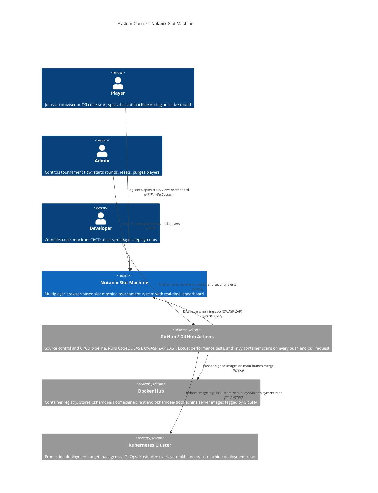
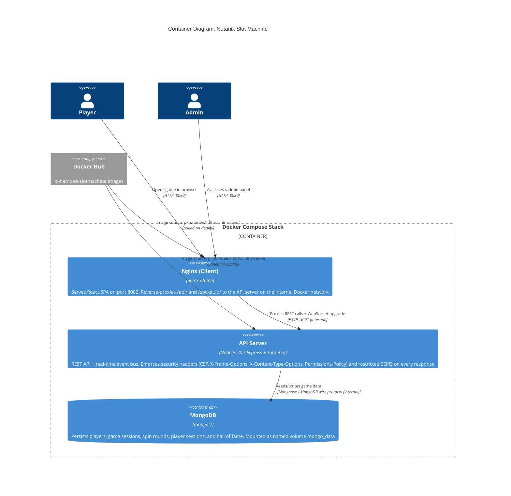
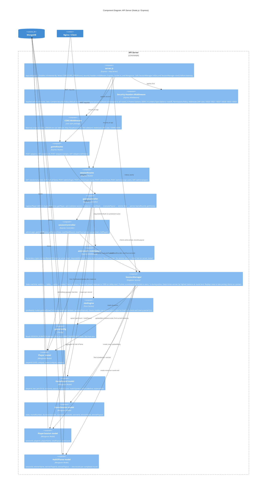
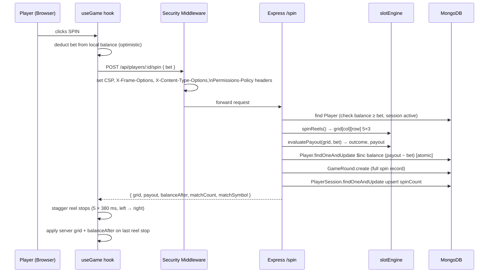
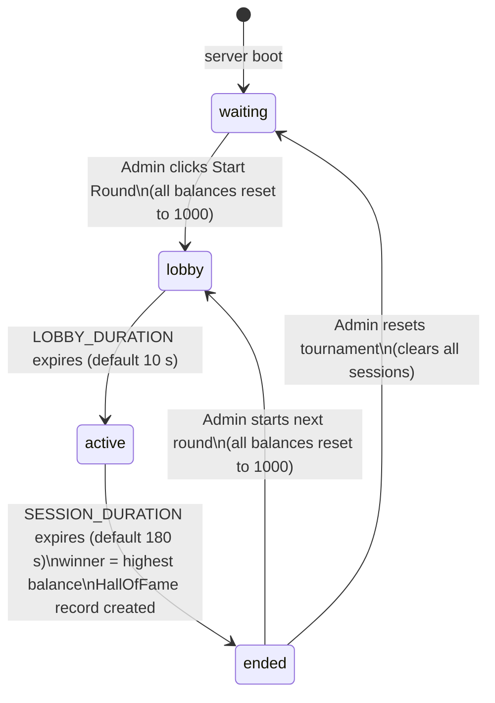
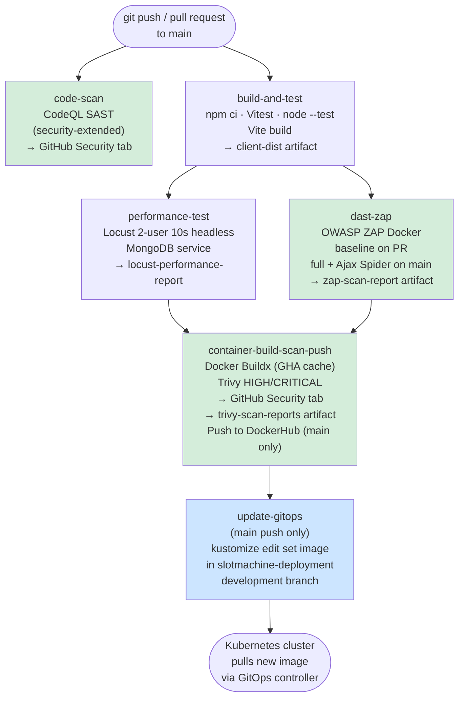

# C4 Architecture Diagram — Nutanix Slot Machine

---

## Level 1 — System Context



---

## Level 2 — Container Diagram



---

## Level 3 — Component Diagram: API Server



---

## Level 3 — Component Diagram: React Client

```mermaid
C4Component
  title Component Diagram: React Client (Vite SPA)

  Container_Boundary(client, "React Client") {

    Component(app, "App.jsx", "React Root Component", "Orchestrates view routing (game / admin). Auto-login from localStorage playerId on mount. Syncs balance on lobby reset. Shows winner overlay on round end")

    Component(useSession, "useSession hook", "React Hook", "Single Socket.io connection per client. Listens for session:state, session:scoreboard, session:ended. Signals balance reset when lobby starts")
    Component(useGame, "useGame hook", "React Hook", "Spin flow: optimistic balance deduction → POST /spin → staggered reel stops 380ms apart. Auto-spin mode. Bet amount controls (10/25/50/100)")

    Component(nameEntry, "NameEntry", "React Component", "Player registration form. Generates QR code pointing to window.location.origin so mobile players can scan to join")
    Component(slotMachine, "SlotMachine", "React Component", "Casino UI: banner, 5×3 reel window, controls bar (BET / AUTO / MAX / SPIN / WIN / BALANCE)")
    Component(reel, "Reel", "React Component", "Renders exactly 3 cells. Animates by cycling symbols every 80ms while spinning. Stops with bounce animation. Highlights winning columns gold")
    Component(betControls, "BetControls", "React Component", "Bet amount selector (10 / 25 / 50 / 100). Disabled during spin")
    Component(balanceDisplay, "BalanceDisplay", "React Component", "Shows current balance; flashes on win/loss")
    Component(scoreboard, "Scoreboard", "React Component", "Top-10 players ranked by balance, updated every 1s via Socket.io push")
    Component(timer, "Timer", "React Component", "Countdown for lobby (pre-round) and active (in-round) states")
    Component(winnerAnnouncement, "WinnerAnnouncement", "React Component", "Overlay on round end — winner name and final balance")
    Component(tournamentOver, "TournamentOver", "React Component", "End-of-round screen shown to all non-winning players")
    Component(hallOfFame, "HallOfFame", "React Component", "All-time winners from GET /api/hall-of-fame")
    Component(historyPanel, "HistoryPanel", "React Component", "Last 20 spins for the current player")
    Component(messageBanner, "MessageBanner", "React Component", "Win/loss message overlay shown briefly after each spin result")
    Component(adminLogin, "AdminLogin", "React Component", "Password form — POSTs to /api/admin/login, stores bearer token in React state (not localStorage)")
    Component(adminPage, "AdminPage", "React Component", "Session management: start/reset/next-round, player list, scoreboard, purge. Polls /admin/players every 8s. Forces re-login on 401")

    Component(gameApi, "gameApi.js", "API Client", "All fetch wrappers: registerPlayer, getPlayer, spinReels, getHistory, adminLogin, startNextRound, resetTournament, purgeUsers, listPlayers, getHallOfFame")
    Component(symbols, "symbols.js", "Constants", "8 symbols with emoji, weight (used for server-side weighted random), and payout multipliers for 3/4/5-of-a-kind")
  }

  Container(server, "API Server")

  Rel(app, useSession, "session state, scoreboard, winner, balanceReset")
  Rel(app, nameEntry, "shown when no player logged in")
  Rel(app, slotMachine, "shown in game view")
  Rel(app, scoreboard, "shown in sidebar")
  Rel(app, timer, "shown in game view")
  Rel(app, winnerAnnouncement, "overlay on round end")
  Rel(app, hallOfFame, "shown in sidebar")
  Rel(app, adminPage, "shown in admin view")
  Rel(app, gameApi, "getPlayer() on auto-login")

  Rel(slotMachine, useGame, "spin logic, balance, bet state")
  Rel(slotMachine, reel, "renders 5 Reel components")
  Rel(slotMachine, betControls, "bet amount UI")
  Rel(slotMachine, balanceDisplay, "current balance")
  Rel(slotMachine, messageBanner, "win/loss feedback")
  Rel(slotMachine, historyPanel, "last 20 spins")

  Rel(adminPage, adminLogin, "shown when not authenticated")
  Rel(adminPage, gameApi, "admin API calls")

  Rel(useSession, server, "WebSocket (Socket.io) — session:state, session:scoreboard, session:ended")
  Rel(useGame, gameApi, "spinReels()")
  Rel(useGame, symbols, "client-side random grid during reel animation")
  Rel(gameApi, server, "REST over HTTP")
  Rel(hallOfFame, gameApi, "getHallOfFame()")
  Rel(nameEntry, gameApi, "registerPlayer()")
```



---

## Data Flow — Spin Sequence



---

## Data Flow — Session State Machine



---

## CI/CD Pipeline



### Security Gates per Commit

| Stage | Tool | Finding severity that blocks | Output |
|---|---|---|---|
| SAST | CodeQL | Error / Warning (security-extended) | GitHub Security → Code scanning |
| DAST | OWASP ZAP | FAIL rules in `.zap/rules.tsv` | `zap-scan-report` artifact |
| Container SCA | Trivy | HIGH / CRITICAL with fix available | GitHub Security → Code scanning |
| Performance | Locust | Server error rate > threshold | `locust-performance-report` artifact |

---

## Deployment View

```mermaid
C4Deployment
  title Deployment: Docker Compose (single host) + GitOps (Kubernetes)

  Deployment_Node(ci, "GitHub Actions", "CI/CD runner") {
    Container(pipeline, "CI Pipeline", "6-job workflow", "CodeQL · Locust · ZAP · Trivy · Docker push · kustomize update")
  }

  System_Ext(dockerhub, "Docker Hub", "pkhamdee/slotmachine — client and server images tagged by Git SHA")
  System_Ext(deployrepo, "slotmachine-deployment repo", "Kustomize overlays for development and production")

  Deployment_Node(host, "Linux Host", "Docker Engine") {
    Deployment_Node(clientContainer, "slotmachine-client", "nginx:alpine") {
      Container(nginxInst, "Nginx", "Serves React SPA, reverse-proxies /api/ and /socket.io/ to server:3001")
    }
    Deployment_Node(serverContainer, "slotmachine-server", "node:20-alpine") {
      Container(serverInst, "Express + Socket.io", "REST API, real-time event bus, security headers middleware")
    }
    Deployment_Node(mongoContainer, "slotmachine-mongo", "mongo:7") {
      ContainerDb(mongoInst, "MongoDB", "Named volume: mongo_data")
    }
  }

  Deployment_Node(k8s, "Kubernetes Cluster", "GitOps-managed") {
    Container(k8sclient, "slotmachine-client pod", "nginx:alpine", "From DockerHub image")
    Container(k8sserver, "slotmachine-server pod", "node:20-alpine", "From DockerHub image")
  }

  Person(user, "User / Admin")

  Rel(pipeline, dockerhub, "pushes images on main merge")
  Rel(pipeline, deployrepo, "kustomize edit set image")
  Rel(deployrepo, k8s, "GitOps controller syncs overlays")
  Rel(dockerhub, k8sclient, "image pull")
  Rel(dockerhub, k8sserver, "image pull")
  Rel(dockerhub, nginxInst, "image pull on compose up")
  Rel(dockerhub, serverInst, "image pull on compose up")

  Rel(user, nginxInst, "HTTP :8080")
  Rel(nginxInst, serverInst, "HTTP :3001 (internal)")
  Rel(serverInst, mongoInst, "MongoDB :27017 (internal)")
```
